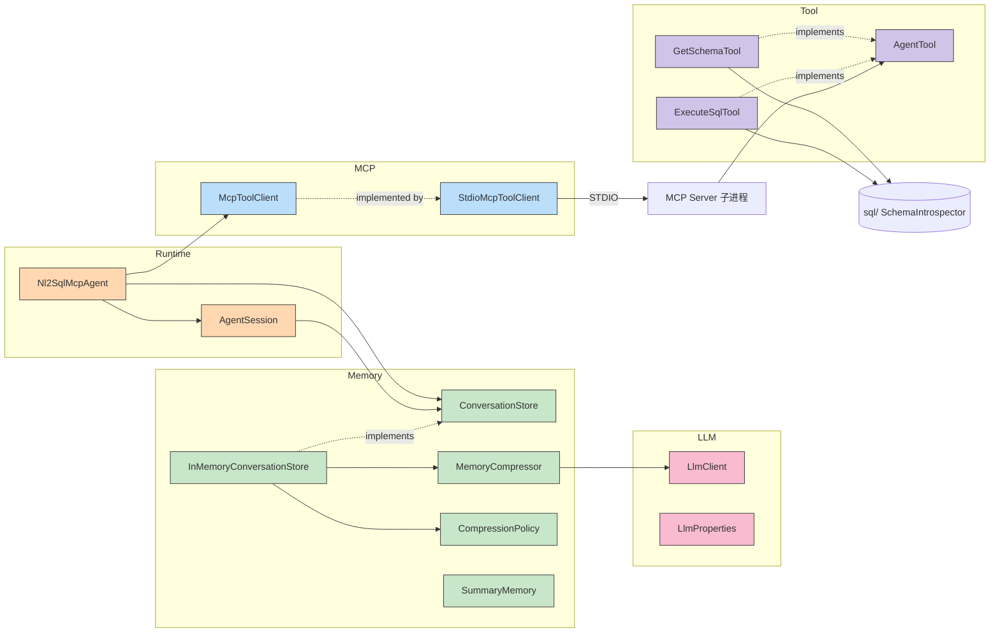

# 五大子系统边界

> **Runtime / Memory / MCP / LLM / Tool** —— 五个互相解耦的子系统，各自有明确的职责、依赖方向、扩展点。
> 本文件是"想改东西但怕改坏"时的对照表。

---

## 一、子系统一览

| 子系统 | 核心类型 | 职责 | 依赖 |
|--------|----------|------|------|
| **Runtime** | `Nl2SqlMcpAgent`, `AgentSession`, `TokenUsage` | 编排"开 session → 跑循环 → 收尾";不感知具体工具/记忆实现 | Memory, MCP, LLM |
| **Memory** | `ConversationStore`, `SummaryMemory`, `MemoryCompressor`, `CompressionPolicy` | 短期会话记忆 + 摘要压缩 | LLM（压缩时用） |
| **MCP** | `McpToolClient` (接口) + `StdioMcpToolClient` (实现) | 进程边界工具调用,屏蔽 STDIO 细节 | （调起独立子进程） |
| **LLM** | `LlmClient` + `LlmProperties` + `ChatMessage`/`LlmResponse`/`ToolCall`/`ToolDefinition` | 通用 LLM 客户端,封 OpenAI 协议 | （HTTP 调外部 API） |
| **Tool** | `AgentTool` (接口) + `GetSchemaTool` / `ExecuteSqlTool` | 工具能力定义 + 本地执行;与 MCP 工具为两套实现 | SQL 层（执行 SQL） |

---

## 二、各子系统边界

### 2.1 Runtime

**位置**：`agent/mcp/Nl2SqlMcpAgent.java` + `agent/session/`

**核心契约**：
- 公开方法：`answer(String question)` / `answer(String, String)` —— 签名不可变。
- 返回：`ToolCallingResult`（含 messages / toolCalls / trace）。
- 异常：`ToolCallingExhaustedException`（含 trace）。

**内部三段式**（V2 第五阶段）：
```
openSession        → 建 trace + 加载 memory
buildInitialMessages → 拼装 system + summary + turns + question
executeOnSession   → 循环 LLM + 工具调用
finalizeSession    → 成功时 store.appendTurn;失败时抛异常
```

**允许改的**：
- messages 拼装顺序（在 buildInitialMessages 内）
- 循环上限（`MAX_ROUNDS`）
- 增加 metadata key（`session.put(key, value)`）
- 新增 session 字段（向后兼容即可）

**禁止改的**：
- 公开方法签名
- `ToolCallingResult` / `ToolCallingExhaustedException` 字段
- Trace 步骤顺序契约（USER_QUESTION 必须为首步骤）

---

### 2.2 Memory

**位置**：`agent/memory/`

**核心契约**：
- `ConversationStore` 接口：`getOrCreate` / `find` / `size` / `appendTurn`。
- 写回由 `appendTurn` 内部完成压缩,Agent 只调一行。
- 压缩策略 `CompressionPolicy` 是策略模式,默认 `TurnCountCompressionPolicy(threshold, keepRecent)`。

**核心类型**：
| 类型 | 角色 |
|------|------|
| `ConversationMemory` | 单 session 短期记忆（turns + summary） |
| `ConversationTurn` | 单轮问答（question + answer + timestamp） |
| `SummaryMemory` | 压缩摘要（summary + keyFacts + version + updatedAtMs） |
| `ConversationStore` | 存储接口（按 sessionId 索引） |
| `InMemoryConversationStore` | V1 默认实现（`ConcurrentHashMap`） |
| `MemoryCompressor` | 调 LLM 做压缩的服务 |
| `CompressionPolicy` | 触发策略接口（未来可加 token-based） |

**允许改的**：
- 新增 `CompressionPolicy` 实现（token-based / time-based）
- 新增 `ConversationStore` 实现（Redis / MySQL）
- 升级 `MemoryCompressor` 的 prompt 模板

**禁止改的**：
- `ConversationMemory.toChatMessages` 输出格式（LLM 依赖 user/assistant 交替）
- `appendTurn` 触发压缩的语义（先 addTurn,后 maybeCompress）

---

### 2.3 MCP

**位置**：`agent/mcp/McpToolClient.java` (接口) + `StdioMcpToolClient.java` (实现)

**核心契约**：
- `McpToolClient` 屏蔽具体传输（STDIO / SSE / HTTP）。
- 所有异常必须吞掉,以 `Error: ...` 字符串返回。
- `listTools()` 失败返回空列表（不抛）。

**进程模型**：
```
主 Spring 上下文
  └─ StdioMcpToolClient ── STDIO ──> 子进程: McpServerMain
                                          └─ McpSyncServer
                                              ├─ get_schema tool → SchemaSelector
                                              └─ execute_sql tool → SqlValidator + SqlExecutor
```

**允许改的**：
- 新增 `McpToolClient` 实现（SSE / WebSocket）
- MCP 子进程命令配置（`mcp.command` / `mcp.args`）
- 开关：`mcp.agent.enabled=false` 时整条链路不装配

**禁止改的**：
- 在 MCP 端反向引用主上下文的 Bean
- 主上下文直接调 `McpSyncClient`（必须经过 `McpToolClient` 接口）
- 进程间通信协议（STDIO JSON-RPC 是 MCP 协议层决定的）

---

### 2.4 LLM

**位置**：`llm/`

**核心契约**：
- `LlmClient.chat(messages)` —— 纯文本对话
- `LlmClient.chatWithTools(messages, tools)` —— 带工具调用
- `LlmResponse` 含 `content / finishReason / toolCalls`（V1 阶段 `usage` 暂未解析）

**OpenAI 协议字段**：
| 字段 | 类型 | 用途 |
|------|------|------|
| `role` | user/assistant/system/tool | 消息角色 |
| `content` | string | 文本内容 |
| `tool_calls` | list（仅 assistant） | 工具调用请求 |
| `tool_call_id` | string（仅 tool） | 对应 assistant 调用 id |

**允许改的**：
- `LlmProperties` 切换 Provider（base-url / model 改环境变量）
- 新增 `LlmResponse.usage` 解析（V2 后续阶段）
- 加重试 / 限流包装

**禁止改的**：
- `ChatMessage` / `ToolCall` / `ToolDefinition` 的字段语义
- assistant + tool 消息的顺序（OpenAI 协议要求）

---

### 2.5 Tool

**位置**：`agent/tools/`（本地）+ `mcp/server/`（MCP 注册）

**核心契约**：
- `AgentTool` 接口：`definition()` + `execute(argumentsJson)`。
- execute 必须吞异常返回 `Error: ...`。
- 不允许抛 `RuntimeException`。

**两套实现**：
- **V1 本地工具**（`agent/tools/GetSchemaTool` / `ExecuteSqlTool`）：被 `Nl2SqlToolAgent` 直接调用，V1 路径。
- **MCP 工具**（`mcp/server/McpServerFactory` 注册的同名工具）：被 `Nl2SqlMcpAgent` 通过 MCP 客户端调用，V2 路径。

**两套工具**目前共用同一份 SQL 业务代码（`sql/SqlValidator` / `SqlExecutor`），通过不同 transport 暴露。

**允许改的**：
- 新增工具（在 MCP Server 注册 + 在 `agent.tools` 也可同步本地版）
- 工具参数 schema

**禁止改的**：
- execute 的异常处理契约
- 工具返回值类型（必须是字符串）
- 复用 `sql.SqlValidator` 作为安全边界（不能跳过）

---

## 三、依赖方向图



---

## 四、扩展点速查

| 想做什么 | 改哪里 | 涉及子系统 |
|----------|--------|------------|
| 加一个工具 | MCP: `McpServerFactory` 注册;或本地: `agent/tools/` 新建 | Tool / MCP |
| 切换 LLM Provider | `application.yml` 改 `llm.*` | LLM |
| 改压缩触发策略 | 新建 `CompressionPolicy` 实现,`MemoryConfig` 注入 | Memory |
| 改压缩 prompt | `MemoryCompressor.SYSTEM_PROMPT` 字符串 | Memory + LLM |
| 加 session 字段 | `AgentSession` 增字段 + Builder | Runtime |
| 持久化 memory | 新建 `ConversationStore` 实现 | Memory |
| 解析 LLM usage | `LlmResponse` 加 usage 字段;`LlmClient` 解析;`Agent` 累加到 `TokenUsage` | LLM / Runtime |
| 加 REST 接口 | `controller/` 新建 Controller | (接入层) |
