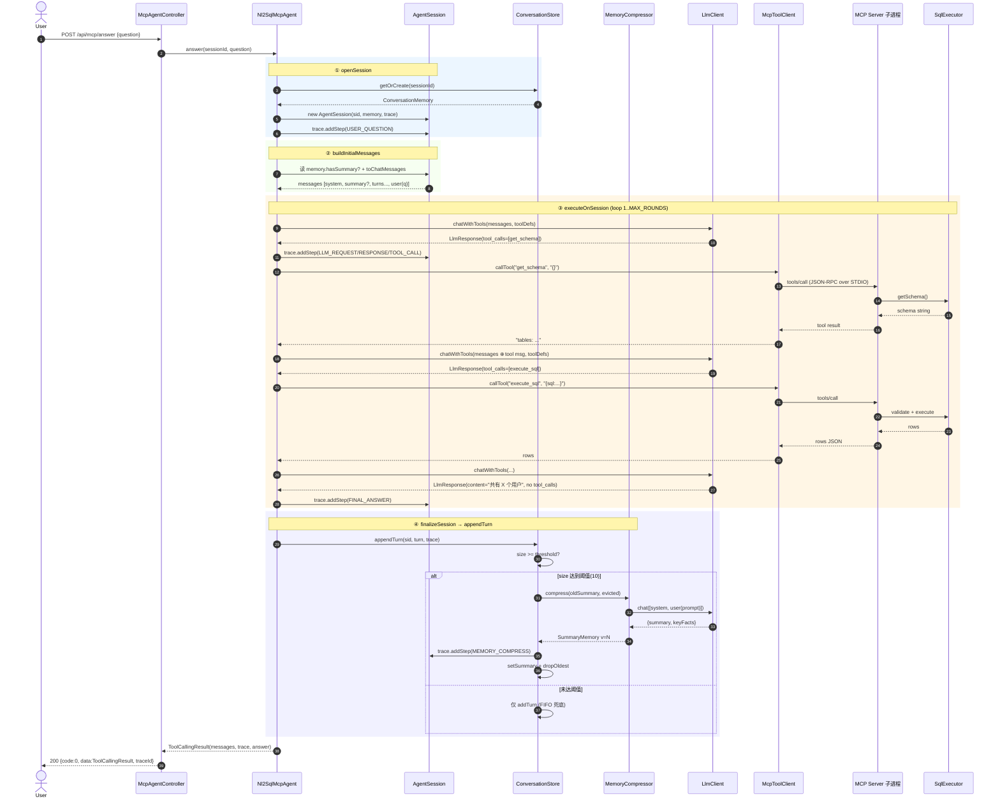

# NL2SQL Agent 当前调用链

> 涵盖 **HTTP 入口 → Agent 编排 → LLM 决策 → MCP 工具执行 → Memory 写回** 的完整路径。
> 以"一次有 sessionId 的成功调用"为例。

---

## 一、时序图（Happy Path）



---

## 二、消息流（messages 列表变化）

```
初始 (buildInitialMessages):
  [0] system:  SYSTEM_PROMPT
  [1] system?: ## 历史摘要 + ## 关键事实  (仅 memory.hasSummary)
  [2..n] user/assistant: memory.toChatMessages() 展开
  [n+1] user:  当前 question

第 1 轮 LLM 调用 → 收到 tool_calls=[get_schema]:
  append assistant({content:null, tool_calls:[...]})
  loop 每个 tool_call:
    append tool({content: result, tool_call_id: ...})

第 2 轮 LLM 调用 → 收到 tool_calls=[execute_sql]:
  append assistant + tool(...)

第 3 轮 LLM 调用 → 收到 content(无 tool_calls):
  append assistant({content: "共有 X 个用户", tool_calls:null})
  → return success
```

---

## 三、Trace 步骤序列（典型成功调用）

```
[1] USER_QUESTION        "Q"
[2] LLM_REQUEST          "round=1"
[3] LLM_RESPONSE         "(tool call)"            # content=null 时的占位
[4] TOOL_CALL            "get_schema {}"
[5] TOOL_RESULT          "tables: ..."            # ≤1000 字符
[6] LLM_REQUEST          "round=2"
[7] LLM_RESPONSE         "(tool call)"
[8] TOOL_CALL            "execute_sql {sql:...}"
[9] TOOL_RESULT          "[{...}]"
[10] LLM_REQUEST         "round=3"
[11] LLM_RESPONSE        "共有 X 个用户"
[12] FINAL_ANSWER        "共有 X 个用户"
```

如果第 10 轮触发压缩，trace 还会多一个 `MEMORY_COMPRESS` 步骤。

---

## 四、关键代码定位

| 阶段 | 文件 / 方法 | 行号范围 |
|------|-------------|----------|
| HTTP 入口 | `controller/McpAgentController.java:answer` | 60-66 |
| openSession | `agent/mcp/Nl2SqlMcpAgent.java:openSession` | 私有方法 |
| buildInitialMessages | `agent/mcp/Nl2SqlMcpAgent.java:buildInitialMessages` | 私有方法 |
| executeOnSession | `agent/mcp/Nl2SqlMcpAgent.java:executeOnSession` | 私有方法 |
| finalizeSession | `agent/mcp/Nl2SqlMcpAgent.java:finalizeSession` | 私有方法 |
| LLM 调用 | `llm/LlmClient.java:chatWithTools` | 84-102 |
| MCP 工具执行 | `agent/mcp/StdioMcpToolClient.java:callTool` | 内部 |
| Memory 压缩 | `agent/memory/MemoryCompressor.java:compress` | 私有方法 |
| 压缩触发 | `agent/memory/InMemoryConversationStore.java:maybeCompress` | 私有方法 |
| 写回 turn | `agent/memory/InMemoryConversationStore.java:appendTurn` | 公开方法 |
| Trace 步骤写入 | `agent/trace/AgentTrace.java:addStep` | 43-52 |

---

## 五、失败路径

| 失败点 | 表现 | 收尾 |
|--------|------|------|
| LLM 抛异常 | `RestClientException` 透传到 `executeOnSession` | 异常冒泡,`finalizeSession` 不写 turn |
| 工具返回 `Error: ...` | 字符串回填到 tool 消息 | 循环继续,让 LLM 自修复 |
| MAX_ROUNDS 耗尽 | 抛 `ToolCallingExhaustedException` | 不写 turn,异常携带 trace |
| MCP 子进程死 | `McpSyncClient` 调用失败 | 工具层返回 `Error: ...`,循环继续 |
| 压缩 LLM 失败 | `MemoryCompressor.compress` 返回 null | `InMemoryConversationStore` 写 ERROR 步骤,保留原 turn,FIFO 兜底 |
| 压缩 token 解析失败 | JSON 解析异常 | 同上,降级保留 |
