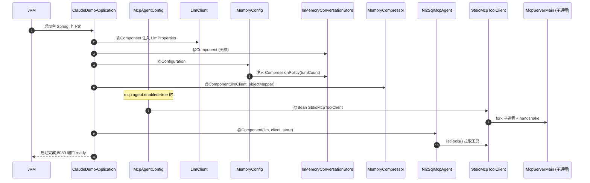

# 模块划分与依赖关系

> V2 第五阶段定稿后的全量模块清单。所有路径相对 `src/main/java/com/example/claudedemo/`。

---

## 一、按包划分的子系统

```
com.example.claudedemo
├── ClaudeDemoApplication.java          // Spring Boot 启动类
│
├── controller/                          ── 接入层
│   ├── HealthController.java
│   └── McpAgentController.java         // POST /api/mcp/answer
│
├── dto/                                 ── 入参 DTO
│   └── McpAnswerRequest.java
│
├── common/                              ── 通用
│   ├── Result.java                     // 统一响应 {code, message, data, traceId}
│   ├── ErrorCode.java
│   ├── GlobalExceptionHandler.java
│   └── BuildInfo.java
│
├── sql/                                 ── 持久化层（V1 业务底盘）
│   ├── SchemaIntrospector.java         // 元数据查询
│   ├── SchemaSelector.java
│   ├── SqlValidator.java               // 注入 LIMIT / 拦截危险 SQL
│   ├── SqlExecutor.java                // 只读 SELECT
│   ├── ValidatedSql.java
│   ├── ColumnInfo.java
│   ├── SqlErrorCode.java
│   └── SqlValidationException.java
│
├── llm/                                 ── LLM 客户端（与具体 Provider 解耦）
│   ├── LlmClient.java                  // chat() / chatWithTools()
│   ├── LlmProperties.java              // base-url / api-key / model
│   ├── ChatMessage.java                // role / content / toolCalls / toolCallId
│   ├── LlmResponse.java                // content / finishReason / toolCalls
│   ├── ToolCall.java
│   └── ToolDefinition.java
│
├── mcp/                                 ── MCP Server 进程（独立 Spring 上下文）
│   ├── McpServerMain.java              // 启动入口（STDIO）
│   └── server/
│       ├── McpServerConfig.java        // 独立 @Configuration
│       ├── McpDataSourceConfig.java    // 手动 DataSource bean
│       ├── McpServerFactory.java       // 构造 McpSyncServer + 注册工具
│       ├── McpServerMetadata.java
│       ├── Jackson2McpJsonMapper.java
│       └── DefaultJsonSchemaValidator.java
│
└── agent/                               ── Agent Runtime V2
    ├── Nl2SqlAgent.java                // V1 固定两轮（保留）
    ├── Nl2SqlToolAgent.java            // V1 Tool Calling（保留）
    ├── AgentResult.java
    ├── AgentStep.java
    ├── ToolCallRecord.java
    ├── ToolCallingResult.java
    ├── ToolCallingExhaustedException.java
    ├── SqlGenerationFailedException.java
    ├── PromptBuilder.java
    │
    ├── tools/                           ── 工具抽象（V1 本地工具）
    │   ├── AgentTool.java              // 接口：definition() + execute()
    │   ├── GetSchemaTool.java          // 给 V1 Nl2SqlToolAgent 用
    │   └── ExecuteSqlTool.java
    │
    ├── trace/                           ── Trace 子系统
    │   ├── AgentTrace.java
    │   ├── TraceStep.java
    │   └── StepType.java               // USER_QUESTION / LLM_REQUEST / ...
    │
    ├── memory/                          ── Memory 子系统
    │   ├── ConversationMemory.java
    │   ├── ConversationTurn.java
    │   ├── ConversationStore.java      // 接口
    │   ├── InMemoryConversationStore.java
    │   ├── SummaryMemory.java
    │   ├── CompressionPolicy.java      // 接口
    │   ├── TurnCountCompressionPolicy.java
    │   ├── MemoryCompressor.java
    │   ├── MemoryProperties.java
    │   └── MemoryConfig.java           // 装配策略 + 配置
    │
    ├── session/                         ── Runtime 上下文（V2 第五阶段）
    │   ├── AgentSession.java
    │   └── TokenUsage.java
    │
    └── mcp/                             ── MCP 客户端（Agent 调用方）
        ├── Nl2SqlMcpAgent.java         // 主角：围绕 AgentSession 工作
        ├── McpAgentConfig.java         // 装配 StdioMcpToolClient
        ├── McpClientProperties.java
        ├── McpToolClient.java          // 接口
        └── StdioMcpToolClient.java
```

---

## 二、依赖方向（自上而下）

> **原则**：上层依赖下层；同层不互相依赖；下层不感知上层存在。
> 圆括号内是"V2 第 N 阶段引入"。

```
┌─────────────────────────────────────────────────────────┐
│  controller/  (HTTP 入口)                               │
└──────────────────┬──────────────────────────────────────┘
                   │ 调用
                   ▼
┌─────────────────────────────────────────────────────────┐
│  agent/Nl2SqlMcpAgent  (V2 Runtime, 第五阶段 AgentSession)│
└──────┬──────────┬──────────┬───────────┬────────────────┘
       │          │          │           │
       ▼          ▼          ▼           ▼
┌──────────┐ ┌────────┐ ┌────────┐ ┌────────────┐
│ session/ │ │memory/ │ │  llm/  │ │agent/mcp/  │
│AgentSess │ │ConvSto │ │LlmClie │ │McpToolClie │
│ion,TokeU │ │Summary │ │ChatMsg │ │StdioMcp... │
└──────────┘ └───┬────┘ └────────┘ └──────┬─────┘
                 │ 调用                      │ 调起子进程
                 ▼                          ▼
           ┌──────────┐              ┌──────────────┐
           │MemoryCom │              │  mcp/server  │
           │pressor + │              │  McpServer   │
           │Compressi │              │  (独立进程)  │
           │onPolicy  │              └──────┬───────┘
           └──────────┘                     │ 复用
                                            ▼
                                     ┌──────────────┐
                                     │  sql/         │
                                     │  SqlValidator │
                                     │  SqlExecutor  │
                                     └──────────────┘
```

**关键依赖方向**：
- `controller` → `agent`（不直接调 `llm` / `mcp`）
- `agent.mcp.Nl2SqlMcpAgent` → `llm` + `agent.memory` + `agent.session` + `agent.mcp.McpToolClient`
- `agent.memory` → `llm`（`MemoryCompressor` 用 `LlmClient.chat` 做摘要）
- `agent.mcp.McpToolClient` → 子进程 `mcp.server`（进程边界，STDIO）
- `mcp.server` → `sql`（与 V1 业务底盘共用）
- **同向不允许**：`mcp.server` 不感知 `agent`；`llm` 不感知 `agent`；`sql` 不感知任何上层。

---

## 三、Spring 装配矩阵

| 配置类 | 作用域 | 关键 Bean |
|--------|--------|-----------|
| `ClaudeDemoApplication` | 主 Spring 上下文 | 全包 `@ComponentScan` 默认启动 |
| `MemoryConfig`（memory） | 主 Spring 上下文 | `CompressionPolicy`（来自 `MemoryProperties`） |
| `McpAgentConfig`（agent.mcp） | 主 Spring 上下文 | `StdioMcpToolClient`（开 `mcp.agent.enabled=true` 才装配） |
| `McpServerConfig`（mcp.server） | **MCP 独立上下文** | `McpServerFactory` + `DataSource`（独立） |
| `McpDataSourceConfig`（mcp.server） | MCP 上下文 | `DataSource` bean |
| `LlmProperties`（llm） | 主 Spring 上下文 | `base-url / api-key / model` |
| `McpClientProperties`（agent.mcp） | 主 Spring 上下文 | MCP 子进程命令/参数 |
| `MemoryProperties`（agent.memory） | 主 Spring 上下文 | `compress-threshold / keep-recent-turns / summary-max-chars` |

**两套 Spring 上下文**：
- **主上下文**（`ClaudeDemoApplication`）：HTTP Controller + Agent + LlmClient + Memory + McpToolClient(客户端)
- **MCP 上下文**（`McpServerMain`）：独立的非 Web Spring 上下文，只扫描 `com.example.claudedemo.mcp` 包，加载 `McpServerFactory` + `DataSource`

> 两套上下文**不共享** Spring 容器；通信靠 STDIO + JSON-RPC 帧。
> 这是 MCP 的本质约束：服务端不能引用客户端任何东西。

---

## 四、装配图（启动期）



---

## 五、关键不变量

1. **进程边界**：`mcp.server` 是独立 JVM 进程，不能反向引用主上下文的 Bean。
2. **构造期拉取**：`StdioMcpToolClient` 在构造期 `listTools()`，工具列表在 Agent 生命周期内不变。
3. **不变量下沉**：Tool 异常必须吞掉返回 `Error: ...`（由 `AgentTool` / `McpToolClient` 契约保证）。
4. **per-session 原子**：Memory 的 `addTurn` + 压缩在 `ConversationMemory.executeUnderLock` 内完成。
5. **解耦五子系**：Runtime / Memory / MCP / LLM / Tool 互相通过接口 / 数据结构通讯，无强耦合。
